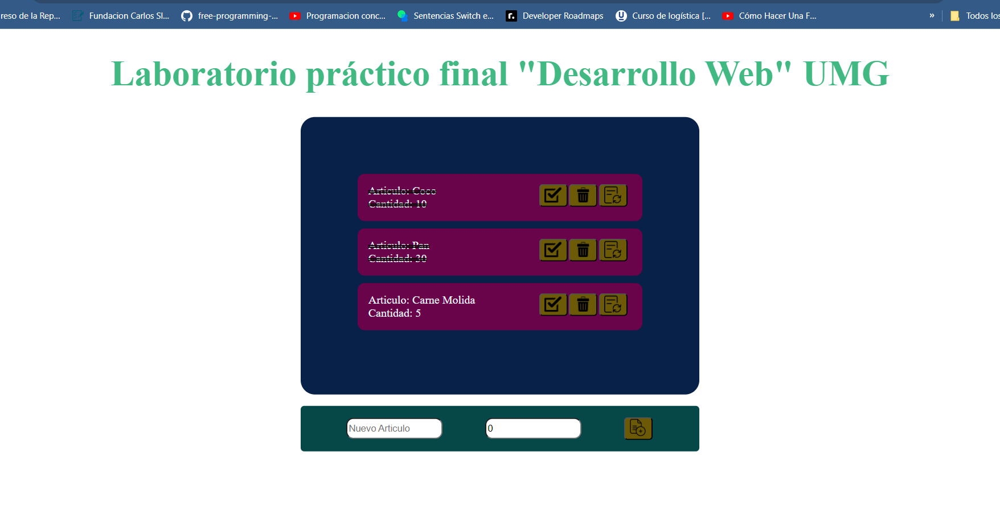

# Laboratorio Practico Desarrollo Web
# Universidad Mariano Galvez de Guatemala 
## Walter Francisco Diaz Morales 2294-20-14526

### Especificaciones 
Descripción:
Implementar métodos para realizar CRUD, para una lista de compras, que contenga los campos [Id, Nombre, Cantidad, Realizado].

Adjuntar imágenes del ejercicio funcionando.

Utilizar git para registrar los cambios realizados y subir el repositorio a GitHub, GitLab o Bitbucket.

# Lista de compras
## Herramientas a Utilizar 
* Backend: Node.JS / Express 
* Frontend: Vue.JS
* Base de Datos: SQLite 

## Base de datos SQLite  

SQLite  no soporta el uso de datos booleanos (tue,false)
Por tal motivo implemente 1(true "No realizado") y 0 (false "realizado")

## Web App  "Lista de Compras"
Agregamos un nuevo articulo

Articulo agregado exitosamente 

### !Revisemos la base de datos


## Actualizar un articulo
* Podemos actualizar un ariculo con los botones que tenemos disponibles, estos son:
        
        *Boton realizado 
        *Eliminar 
        *Actualizar

Acutalizamos el Articulo pezcado  por Carne molida y que sean  5 lib.


Guardamanos cambios 

### En la base de datos 


## Marcar Acticulo como realizado y eliminar articulo
Para estas acciones solo damos clic en los botenes de "check" para realizado  y del "trash/papelera" Para eliminar el articulo  
### Marcar como realizado 

### En la Base de Datos 
En la base de datos el estatus cambio de 1 a 0


### Eliminar Articulo 
Para elimar solo pulsamos el el boton con el icono de papelera

### En la Base de Datos 
Al refrescar la base de datos el articulo se a eliminado.


## Haz clic para ver la API  -->
[Base_de_Datos_Lista_de_Compras](https://github.com/walter7f/LaboratorioPractico-DesarrolloWeb/tree/main/dbtodo)

#     ¡Gracias!... 
------------------------------


## Project setup
```
npm install
```

### Compiles and hot-reloads for development
```
npm run serve
```

### Compiles and minifies for production
```
npm run build
```
